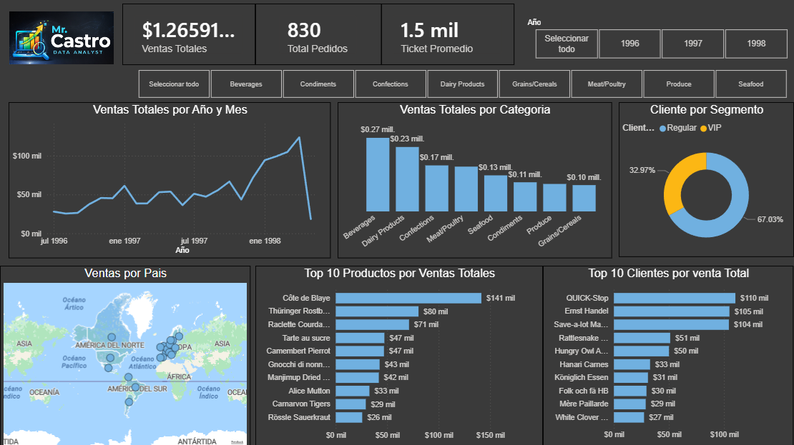

# 📊 Northwind Analytics  
Modelo Analítico en SQL Server & Power BI

## 📌 Descripción del proyecto

Este proyecto implementa un modelo analítico profesional (Star Schema) a partir de la base de datos Northwind, utilizando SQL Server (T-SQL) para la preparación de datos y Power BI para la visualización y análisis.

El objetivo es simular un proyecto real de Business Intelligence, separando claramente:
- Capa de datos (SQL Server)
- Capa semántica y visual (Power BI)

---

## 🎯 Objetivos de negocio

El proyecto responde a las siguientes preguntas clave:

- ¿Cuál es el ingreso total del negocio?
- ¿Cómo evolucionan las ventas en el tiempo?
- ¿Cuál es la variación Mes vs Mes (MoM) y Año vs Año (YoY)?
- ¿Qué países, productos y categorías generan más ingresos?
- ¿Quiénes son los clientes más valiosos?
- ¿Cómo es el desempeño del equipo comercial?
- ¿Qué productos presentan baja rotación?

---

## 🧱 Arquitectura del modelo

Se diseñó un modelo estrella (Star Schema) compuesto por:

- Tablas de Hechos (Facts): métricas cuantitativas
- Tablas de Dimensión (Dimensions): contexto del negocio

Este enfoque permite:
- Mejor performance en Power BI
- Escalabilidad
- Reutilización de métricas
- Time Intelligence confiable

---

## 📐 Vistas creadas en SQL Server

### 🔹 Facts

#### vw_FactSales
Hecho principal de ventas con el siguiente grano:

> 1 fila = 1 producto vendido en una orden

Contiene métricas base como:
- Cantidad vendida
- Precio unitario
- Descuento
- Importe de venta (SalesAmount)
- Claves hacia clientes, productos, empleados y fecha

Es la base para:
- Ventas totales
- Ventas por producto, cliente y categoría
- Análisis MoM y YoY
- Ticket promedio (AOV)

---

#### vw_FactOrders
Hecho de pedidos con el siguiente grano:

> 1 fila = 1 orden

Se utiliza para:
- Conteo de órdenes
- Frecuencia de compra
- Análisis de volumen comercial

---

### 🔹 Dimensions

#### vw_DimCustomers
Dimensión de clientes:
- Información del cliente
- País y ciudad
- Base para segmentación y análisis RFM

---

#### vw_DimProducts
Dimensión de productos:
- Producto
- Categoría
- Proveedor

Permite:
- Ranking de productos
- Ventas por categoría
- Análisis de portafolio

---

#### vw_DimEmployees
Dimensión de empleados (vendedores):
- Información del equipo comercial

Se utiliza para:
- Medición de desempeño
- Comparación entre vendedores

---

#### vw_DimShippers
Dimensión de transportistas:
- Empresa de envío

Permite analizar:
- Volumen de envíos
- Relación logística–ventas

---

#### vw_DimDate
Dimensión calendario:
- Fecha
- Año
- Mes
- Trimestre
- Año–Mes

Es clave para:
- Análisis temporal
- Tendencias de ventas
- Cálculos de MoM y YoY

---

## 📊 Métricas principales

Derivadas principalmente de vw_FactSales:

- Ventas Totales
- Cantidad Vendida
- Ventas con Descuento
- Ventas por País
- Ventas por Categoría
- Ventas por Producto
- Ventas por Cliente
- Ventas por Empleado
- Ventas Mensuales
- Variación Mes vs Mes (MoM %)
- Ticket Promedio (AOV)

---
### 🏗️ Arquitectura

- Arquitectura en 2 capas:

SQL Server (Modelo Analítico)
        ↓
Power BI (Modelo Semántico + Dashboards)

## 📈 Visualización en Power BI

El modelo es consumido directamente en Power BI, donde se construyó:

- Dashboard ejecutivo de ventas
- Gráfico combinado: Ventas + MoM %
- KPIs de crecimiento
- Análisis por territorio, producto y cliente
- Tooltips personalizados
- Ejes temporales basados en la DimDate

---

👤 Autor: Luis Castro Bernales

Proyecto desarrollado como ejercicio profesional de Business Intelligence & Data Analytics.
